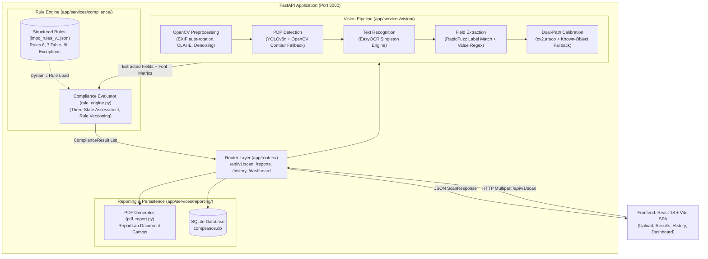

# Technical Documentation & Software Architecture Specification

**Project:** SIH26034 — Automated Legal Metrology Compliance Checker  
**Statutory Framework:** Legal Metrology (Packaged Commodities) Rules, 2011  
**Document Version:** 1.0  
**Lead Author:** Parul (Technical Documentation & Legal Content)  
**System Owners:** Shubh (Vision & Machine Learning), Aditya (Compliance Engine, Reporting & DB), Keshav (Frontend)

---

## 1. Executive Summary & Problem Statement Alignment

Under **Smart India Hackathon Problem Statement SIH26034**, enforcement officers of the Department of Consumer Affairs inspect packaged commodities across retail markets to ensure compliance with the **Legal Metrology (Packaged Commodities) Rules, 2011**. 

Manual inspection of packaging labels is labor-intensive, subjective, and prone to human oversight. Common non-compliances—such as omitted Maximum Retail Price (MRP) tax stipulations, missing Consumer Care grievance contacts, non-standard net quantity units, or numeral font heights below statutory minimum thresholds—frequently evade detection.

```
┌─────────────────┐       ┌──────────────────────────────┐       ┌─────────────────────────┐
│ Smartphone/Web  │ ────► │ Automated Pipeline:          │ ────► │ Evidence-Backed Output: │
│ Photo of Label  │       │ Detect ➔ OCR ➔ Extract ➔     │       │ Three-State Verdicts,   │
│ with Calibrator │       │ Calibrate ➔ Evaluate Rules   │       │ Calibrated Calipers,    │
└─────────────────┘       └──────────────────────────────┘       │ PDF Inspection Reports  │
                                                                 └─────────────────────────┘
```

This system provides an **automated, evidence-first, decision-support prototype** that:
1. Detects the Principal Display Panel (PDP) and extracts mandatory Rule 6 declarations.
2. Calibrates physical millimeter character heights using optical reference markers (ArUco / reference objects).
3. Evaluates declarations against structured statutory thresholds stored in [`backend/app/data/rules/lmpc_rules_v1.json`](file:///Users/shubhverma/vscode/sih2026-legal-metrology/backend/app/data/rules/lmpc_rules_v1.json).
4. Generates tamper-evident, plain-language PDF inspection reports with visual bounding boxes for regulatory action.

---

## 2. Software Architecture & System Topology

The system adopts a modular, decoupled client-server architecture built on **FastAPI (Python)** and **React (Vite)**, designed for zero-cloud, 100% offline demonstration on a local laptop.



---

## 3. Vision & Machine Learning Pipeline Deep Dive

The vision pipeline is designed on a **fallback-first principle**: every stage degrades gracefully to an alternative algorithm rather than raising unhandled exceptions on unusual or degraded inputs.

### 3.1 Preprocessing Service (`preprocessing.py`)
Phone-captured images often suffer from glossy glare, low contrast, and EXIF orientation discrepancies.
- **EXIF Auto-Orientation:** `decode_image()` uses `cv2.IMREAD_COLOR` on raw bytes to guarantee smartphone portrait photos are never decoded sideways.
- **Demo Speed Resizing:** `resize_to_max_dimension(image, max_dim=1600)` scales 12MP+ smartphone images down to $\le 1600\text{px}$ preserving aspect ratio, eliminating CPU bottlenecks.
- **CLAHE (Contrast Limited Adaptive Histogram Equalization):** Applied in LAB lightness space for color packaging, equalizing harsh phone flash reflections.
- **Edge-Preserving Smoothing:** Bilateral filtering denoises glossy plastic films while keeping font edges sharp.
- **Adaptive Gaussian Thresholding:** Provides binary masks for geometric contour detection.

### 3.2 Principal Display Panel Detection (`detection.py`)
- **Primary:** YOLOv8n fine-tuned on packaging bounding boxes.
- **Mandatory Fallback:** `opencv_fallback_detect()` executes contour detection on the binary mask, finding the largest dominant convex bounding rectangle. If YOLO weights are absent or confidence $< 0.60$, the system automatically falls back to OpenCV.

### 3.3 Text Recognition (`ocr.py`)
- **Engine:** EasyOCR (`easyocr.Reader(["en"], gpu=False)`) wrapped as a thread-safe singleton.
- **Spatial Geometry:** Projects 4-corner polygon coordinates into canonical `BoundingBox(x_min, y_min, x_max, y_max)`.
- **Character Height Measurement:** Extracts `height_px = y_max - y_min` for every detected line to serve downstream physical calibration.

### 3.4 Fuzzy Field Extraction (`extraction.py`)
Raw regex against OCR text fails on typical character confusions (e.g. `MRP` misread as `M8P`, `Nel Wt` instead of `Net Wt`).
- **Pipeline:**
  $$\text{Raw OCR Text} \longrightarrow \text{Normalization} \longrightarrow \text{RapidFuzz Partial Ratio} \ge 75.0 \longrightarrow \text{Value Regex Validation}$$
- **Date Normalization:** Tolerates `/`, `-`, and `.` separators; accepts `DD/MM/YYYY`, `MM/YYYY`, and textual month names. Automatically normalizes full dates to `MM/YYYY` per Rule 6(1)(d) (full dates are over-compliant).
- **Multi-Box Spatial Neighborhood:** `find_spatial_neighbors()` merges adjacent OCR boxes on the same horizontal line or immediately below when label and value are split into separate bounding boxes.
- **Composite Confidence Formulation:**
  $$\text{Confidence} = 0.35 \times \text{OCR\_Confidence} + 0.45 \times \left(\frac{\text{Fuzzy\_Ratio}}{100}\right) + 0.20 \times \text{Regex\_Match}$$

### 3.5 Dual-Path Calibration Service (`calibration.py`)
To evaluate Rule 7 millimeter font-height thresholds from 2D pixel heights:
1. **Primary Method (ArUco Marker):** Detects `cv2.aruco` markers of known physical dimension (e.g. $50\text{ mm}$), yielding physical scale:
   $$\text{Scale} = \frac{\text{Marker Size (mm)}}{\text{Marker Perimeter / 4 (pixels)}} \quad\left[\frac{\text{mm}}{\text{pixel}}\right]$$
2. **Fallback Method (Known Reference Object):** Computes scale from an officer-selected reference object of known dimension passed via `known_object_size_mm`.
3. **Fail-Safe Route:** If neither calibration method succeeds, font-height checks route to `REVIEW_REQUIRED`—never fabricating a measurement or raising an error.

---

## 4. Compliance Rule Engine (`rule_engine.py`)

### 4.1 Separation of Law as Data
Regulatory rules live inside [`backend/app/data/rules/lmpc_rules_v1.json`](file:///Users/shubhverma/vscode/sih2026-legal-metrology/backend/app/data/rules/lmpc_rules_v1.json). The rule engine contains **zero hardcoded legal thresholds or penalty text in Python**:

```json
{
  "version": "LMPC-2011-v1.1",
  "mandatory_fields": [
    { "field_name": "mrp", "rule_id": "RULE_6_1_E_MRP", "rule_reference": "Rule 6(1)(e)" },
    { "field_name": "net_quantity", "rule_id": "RULE_6_1_C_NET_QTY", "rule_reference": "Rule 6(1)(c)" }
  ],
  "violation_templates": {
    "fields": {
      "mrp": {
        "missing": {
          "summary": "Maximum Retail Price (MRP) declaration absent",
          "legal_reference": "Rule 6(1)(e) of LMPC Rules, 2011 read with Section 18/36 of Legal Metrology Act, 2009",
          "recommended_action": "Recommend physical verification; if absence of retail price is confirmed by officer, notice under Section 36(1) may apply."
        }
      }
    }
  }
}
```

### 4.2 Three-State Compliance Logic
Every compliance check assigns one of three statuses:
- **`PASS`:** Affirmative visual evidence meeting statutory criteria.
- **`FAIL`:** Explicit absence or violation of statutory criteria.
- **`REVIEW_REQUIRED`:** Triggered whenever visual confidence $< 0.75$, calibration scale is uncertain, or dot-matrix printing is degraded.

```
                          INDIVIDUAL CHECK
                                 │
                ┌────────────────┴────────────────┐
                ▼                                 ▼
      Meets Statutory Rule?             Does NOT Meet Rule?
                │                                 │
        ┌───────┴───────┐                 ┌───────┴───────┐
        ▼               ▼                 ▼               ▼
Confidence ≥ 0.75?  Confidence < 0.75?  Confidence ≥ 0.75?  Confidence < 0.75?
     [ PASS ]      [ REVIEW_REQUIRED ]    [ FAIL ]      [ REVIEW_REQUIRED ]
```

### 4.3 Category Exceptions Handling
1. **`medical_device`:** Exempt from LMPC Rules 6 & 7 under the 2025 Amendment Rules; governed by Medical Devices Rules, 2017.
2. **`bulk_exempt`:** Exempt from retail declarations under Rule 3 ($> 25\text{ kg/L}$ or institutional supply).
3. **`food_expiry`:** Defers date declarations to food safety standards (FSSAI) per Rule 6(1)(d) proviso, requiring `best_before` / `expiry_date`.

---

## 5. API Contracts & Data Models

All endpoints follow the locked contract in [`docs/API_CONTRACT.md`](file:///Users/shubhverma/vscode/sih2026-legal-metrology/docs/API_CONTRACT.md) and Pydantic schemas in [`backend/app/schemas/scan.py`](file:///Users/shubhverma/vscode/sih2026-legal-metrology/backend/app/schemas/scan.py).

### Core Endpoints Matrix

| HTTP Method | Path | Owner | Description | Response Model |
|---|---|---|---|---|
| `POST` | `/api/v1/scan` | Shubh | Executes full computer vision + compliance pipeline | `ScanResponse` |
| `GET` | `/api/v1/reports/{scan_id}/pdf` | Aditya | Generates and streams official ReportLab PDF | `application/pdf` |
| `GET` | `/api/v1/history` | Aditya | Paginated list of past packaging inspections | `ScanHistoryResponse` |
| `GET` | `/api/v1/dashboard/stats` | Aditya | Summary metrics (pass rates, review rates, top violations) | `DashboardStats` |
| `POST` | `/api/v1/auth/login` | Aditya | Lightweight authentication (`inspector`, `admin`) | `TokenResponse` |

---

## 6. Claims Discipline & Technical Boundaries

In accordance with strict claims discipline:
1. **No Borrowed Benchmarks:** The SROIE dataset is cited strictly as a methodological precedent for document information extraction in computer vision literature—not as an EasyOCR packaging benchmark.
2. **Empirically Verified Tests:** The prototype test suite contains **25 automated tests** in [`backend/tests/`](file:///Users/shubhverma/vscode/sih2026-legal-metrology/backend/tests/) verifying:
   - OpenCV preprocessing, EXIF rotation, and CLAHE.
   - EasyOCR bounding box and character height extraction.
   - RapidFuzz OCR typo tolerance across labels (`M8P`, `Nel Wt`, `Mtg Date`, `Mid By`, `U.S.P`).
   - Rule engine compliance evaluation, confidence thresholds, and category exceptions.
3. **Documented Limitations:**
   - **Dot-Matrix Inkjet Printing:** Faint inkjet droplet stamps (e.g. batch stamps on tetra-packs) typically yield OCR confidence in the $0.35\text{--}0.56$ range. The system correctly routes these cases to `REVIEW_REQUIRED` rather than generating false PASS/FAIL determinations.
   - **Curved Surface Perspective:** Cylindrical cans and tubes introduce barrel distortion. Perspective unwarping is documented as a production roadmap item.
   - **Statutory Caveat on Section 36(1):** Traced from secondary drafting notes; verify against primary Gazette text of Act No. 1 of 2010 before relying in judicial proceedings.

---

## 7. Deployment & Operational Guide

### 7.1 Prerequisites
- Python 3.11+ (tested on Python 3.11 and 3.13)
- Node.js 18+ & npm
- Local system libraries: `libgl1-mesa-glx` (Linux) or native OpenCV dependencies (macOS)

### 7.2 Backend Setup & Execution
```bash
cd backend
python3 -m venv env
source env/bin/activate
pip install -r requirements.txt
uvicorn app.main:app --reload --port 8000
```
Interactive Swagger documentation is available at: `http://localhost:8000/docs`

### 7.3 Frontend Setup & Execution
```bash
cd frontend
npm install
npm run dev
```
Client user interface runs at: `http://localhost:5173`

### 7.4 Running the Test Suite
```bash
PYTHONPATH=backend ./env/bin/pytest backend/tests/ -v
```

---

## 8. Enterprise Production Roadmap

The following architecture extensions are intentionally documented for the post-hackathon enterprise deployment:
- **Cloud Task Queue:** Celery + Redis worker pool for high-concurrency batch processing.
- **Enterprise Database:** Migration from SQLite to PostgreSQL with PostGIS for spatial market inspection mapping.
- **Cryptographic Report Signing:** Asymmetric ECDSA PDF digital signatures establishing chain of custody for court-admissible evidence.
- **Fine-Tuned Multimodal Extraction:** Transitioning from RapidFuzz to fine-tuned zero-shot Vision-Language Models (VLM) for complex bilingual packaging layouts.
